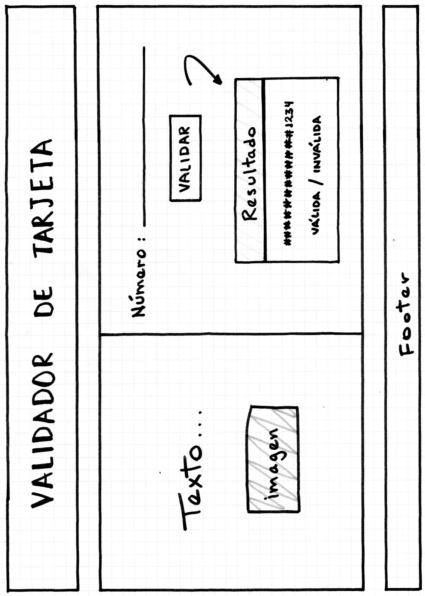
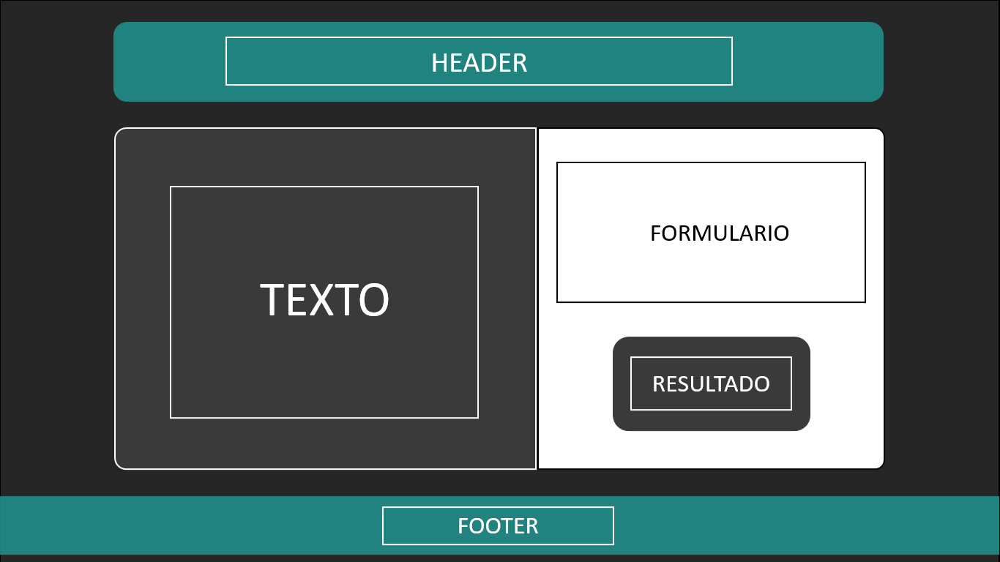

# VALIDADOR DE TARJETA

## Índice

* [1. Resumen del proyecto](#1-resumen-del-proyecto)
* [2. Proyecto final](#2-proyecto-final)
* [3. Ux](#3-Ux) 
* [4. Objetivos de aprendizaje](#4-objetivos-de-aprendizaje)
* [5. Criterios de aceptación mínimos del proyecto](#5-criterios-de-aceptación-mínimos-del-proyecto)
***

## 1. RESUMEN DEL PROYECTO

`VALIDADOR DE TARJETA`, es una página web donde ayuda al usuario a verificar si su tarjeta es válida.
Esta validación se realiza mediante el algoritmo de Luhn.
Elaborado con HTML, CSS y JavaScript.
***

## 2. PROYECTO FINAL

***

## 3. UX

Esta página web fue creada para que el usuario verifique si su tarjeta es válida. 

### Uso de la aplicación

* Se presenta una ventana con un input para ingresar los números de tarjeta.
* Se muestra un botón de validar donde te manda a una nueva ventana y vereficara si la tarjeta es válida.
***

### Prototipo en papel

 

### Feedback

* Recibí feedback de mis compañeras del bootcamp donde me dieron su opinión sobre el proyecto.
* Recibí feedback de los coaches del bootcamp.

### Prototipo final

* Colores utilizados para el proyecto.

***

## 4. OBJETIVOS DE APRENDIZAJE

Aprenderán a construir una aplicación web que interactuará con los usuarios al final, a través del navegador, utilizando HTML, CSS y JavaScript como tecnologías.

### HTML y CSS

* [X] Uso de HTML semántico.
* [X] Uso de selectores de CSS.
* [X] Construir tu aplicación respetando el diseño realizado (maquetación).

### DOM

* [X] Uso de selectores del DOM.
* [X] Manejo de eventos del DOM.
* [X] Manipulación dinámica del DOM.
(appendChild |createElement | createTextNode| innerHTML | textContent | etc.)

### JavaScript

* [X] Manipulación de strings.
* [X] Uso de condicionales (if-else | switch | operador ternario)
* [X] Uso de bucles (for | for..in | for..of | while)
* [X] Uso de funciones (parámetros | argumentos | valor de retorno)
* [X] Declaración correcta de variables (const & let)

### Testing

* [X] Testeo unitario.

### Estructura del código y guía de estilo

* [X] Organizar y dividir el código en módulos (Modularización)
* [X] Uso de identificadores descriptivos (Nomenclatura | Semántica)
* [X] Uso de linter (ESLINT)

### Git y GitHub

* [X] Uso de comandos de git (add | commit | pull | status | push)
* [X] Manejo de repositorios de GitHub (clone | fork | gh-pages)

### UX

* [X] Diseñar la aplicación pensando y entendiendo al usuario.
* [X] Crear prototipos para obtener feedback e iterar.
* [X] Aplicar los principios de diseño visual (contraste, alineación, jerarquía)
***

## 5. Criterios de aceptación mínimos del proyecto

Usa solo caracteres numéricos (dígitos) en la tarjeta a validar [0-9].

### Interfaz de usuario (UI)

La interfaz debe permitir al usuario:

* Insertar el número que queremos validar.
* Ver el resultado si es válido o no.
* Ocultar todos los dígitos de su número de tarjeta menos los últimos
4 caracteres.
* No debe poder ingresar un campo vacío.
***